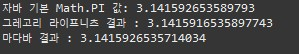

# OOP2026
### Homework1
```java

public class Homework1 {

	public static void main(String[] args) {
		int i, j;
        for (i = 0; i < 10; i++) {
            for (j = 0; j <= i; j++) {
                System.out.print("#");
            }
            System.out.println();
        }
        
        System.out.println();

        for (i = 0; i < 10; i++) {
            for (j = 0; j < 10 - i; j++) {
                System.out.print("#");
            }
            System.out.println();
        }

        for (i = 0; i < 10; i++) {
            for (j = 0; j < 9 - i; j++) {
                System.out.print(" ");
            }
            for (j = 0; j <= i; j++) {
                System.out.print("#");
            }
            System.out.println();
        }

        System.out.println();
        
        for (i = 0; i < 10; i++) {
            for (j = 0; j < i; j++) {
                System.out.print(" ");
            }
            for (j = 0; j < 10 - i; j++) {
                System.out.print("#");
            }
            System.out.println();
        }

	}

}


```


### Homework2
```java
public class Homework2 {

	public static void main(String[] args) {
		int a = 0;
		int b = 1;
		
		for(int i = 1; i<=20; i++) {
			System.out.print(a + " ");
			
			int next = a + b;
			a = b;
			b = next;
		}

	}

}
```


### Homework3
```java

public class Homework3 {

	public static void main(String[] args) {
		
		int a=1;
		int b=2;
		
		for(int i=1; i<=20; i++) {
			double ratio = (double) b / a;
			System.out.println(b + " / "+a+" = "+ratio);
			
			int next = a + b;
			a = b;
			b = next;
		}
	}

}

```


### Homework4
```java

public class Homework4 {

	public static void main(String[] args) {
		int i;
		int j;
		
		for(j = 1; j <= 9; j++) {
			for(i = 1; i <= 9; i++) {
				System.out.println(i+ "*" + j + "=" + (i*j)+ "\t");
			}
			System.out.println();
		}

	}

}

```


### Homework5
```java

public class Homework5{
public static double Gregory_Leibniz(int terms) {
        double pi = 0;

        for (int k = 0; k < terms; k++) {
            double sign;
            if (k % 2 == 0) {
                sign = 1.0; //짝
            } else {
                sign = -1.0; //홀
            }
            double term = sign * 4.0 / (2 * k + 1);
            pi += term;
        }

        return pi;
    }

    public static double Madhava(int terms) {
        double sum = 0;

        for (int k = 0; k < terms; k++) {
            double term = Math.pow(-3.0, -k) / (2 * k + 1); //홀일 때 음수, 짝일 때 양수
            sum += term;
        }
        return Math.sqrt(12.0) * sum;
    }

    public static void main(String[] args) {
        int glTerms = 1000000;
        int madhavaTerms = 20;

        System.out.println("자바 기본 Math.PI 값: " + Math.PI);
        double glResult = Gregory_Leibniz(glTerms);
        System.out.println("그레고리 라이프니츠 결과 : " + glResult); //100만번 반복
        double madhavaResult = Madhava(madhavaTerms);
        System.out.println("마다바 결과 : " + madhavaResult); //20번 반복
    }
}
```

